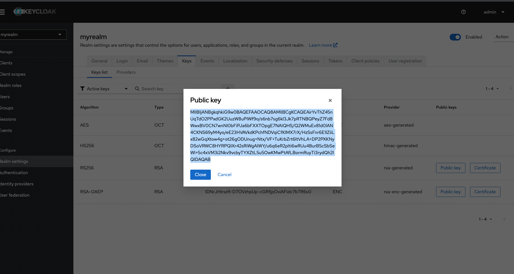

## How to run

Step 1: Run docker compose <br/>

docker-compose up  -d ( -d run as background)<br/>

Change env file <br/>


```
REACT_APP_REALM_NAME=myrealm -> realm name
REACT_APP_KEY_CLOAK_URL=http://127.0.0.1:8080/ -> keyCloak server
REACT_APP_KEY_CLIENT_ID=myclient -> client name
```


<br/>
Access admin

http://0.0.0.0:8080 
<br/>
http://localhost:8080 

===
### start

#### FE and keycloak
docker-compose up


<br/>
### Login nais admin
<br/>

```
user: admin
pw: admin
```

<br/>
create realm and client
<br/>
realm : myrealm
<br/>
client :myclient


=> get api key



#### BE
cd web-server 
setting pulic key env

node server.js